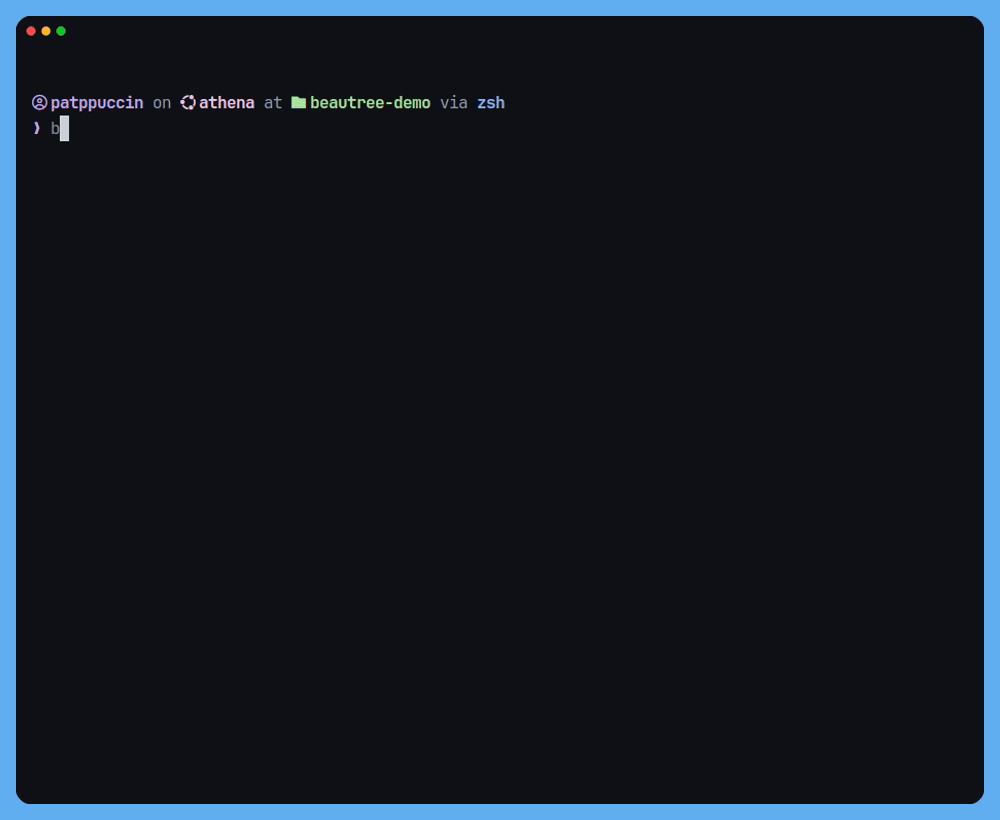

<div align="center">
<br />



</div>

## About

`beautree` is a directory tree viewer for people who find the classic `tree` command lacking. It renders clean Unicode connectors, respects your `.gitignore`, handles symlinks honestly, and gets out of the way.

No subcommands. No magic. A single static binary you can alias to `tree` and forget about.

**What it does:**

- Unicode box-drawing connectors (`╭─ ├─ ╰─`) with automatic ASCII fallback on dumb terminals and pipes
- Reads nested `.gitignore` files at every level — negation patterns, dir-only rules, all of it
- Detects working and broken symlinks, shows targets inline
- Identifies named pipes and sockets
- JSON output for piping into other tools
- Three-layer config: CLI flags → env vars → `config.toml`

**What it doesn't do:**

- No icons, no colors that need a theme, no opinions about your terminal
- No global ignore files, no hidden magic
- No subcommands

---

## Installation

**Linux / macOS**

```sh
curl -fsSL https://patppuccin.dev/beautree/install.sh | sh
```

**Windows (PowerShell)**

```powershell
irm https://patppuccin.dev/beautree/install.ps1 | iex
```

**Go install**

```sh
go install github.com/patppuccin/beautree/src@latest
```

**Manual** — grab a binary from [releases](https://github.com/patppuccin/beautree/releases) and drop it on your `PATH`.

**Alias to `tree`**

```sh
# bash / zsh / fish
alias tree=beautree

# powershell
Set-Alias tree beautree

# nushell
alias tree = beautree
```

---

## Usage

```
beautree [path] [flags]
```

`path` defaults to the current directory.

| Flag            | Short | Description                                | Default   |
| --------------- | ----- | ------------------------------------------ | --------- |
| `--depth N`     | `-L`  | Max depth to recurse, 0 = unlimited        | `0`       |
| `--all`         | `-a`  | Include hidden files and dirs              | `false`   |
| `--dirs-only`   | `-d`  | Show directories only                      | `false`   |
| `--size`        |       | Show human-readable size beside each entry | `false`   |
| `--ignore GLOB` | `-I`  | Exclude entries matching GLOB, repeatable  |           |
| `--no-ignore`   |       | Disable `.gitignore` parsing               | `false`   |
| `--format`      | `-f`  | Output format: `unicode` `ascii` `json`    | `unicode` |
| `--no-color`    |       | Disable color output                       | `false`   |
| `--no-summary`  |       | Disable summary footer                     | `false`   |
| `--output FILE` | `-o`  | Write output to file                       |           |
| `--version`     | `-v`  | Print version                              |           |
| `--help`        | `-h`  | Show help                                  |           |

**Examples**

```sh
# two levels deep
beautree -L 2

# dirs only, hidden included
beautree -da

# exclude patterns
beautree -I node_modules -I dist -I "*.log"

# sizes
beautree --size

# pipe to jq
beautree --format json | jq .

# write to file
beautree -o tree.txt
```

---

## Config

Persistent preferences live at `~/.config/beautree/config.toml`. Respects `XDG_CONFIG_HOME`.

```toml
# ~/.config/beautree/config.toml

depth      = 4
all        = false
no_summary = false
format     = "unicode"
ignore     = ["node_modules", "dist", "*.log"]
```

Env vars work too, prefixed with `BEAUTREE_`:

```sh
BEAUTREE_DEPTH=3
BEAUTREE_FORMAT=ascii
BEAUTREE_NO_SUMMARY=true
```

Precedence: **CLI flags > env vars > config file**.

---

## Contributing

Not accepting pull requests at this time, but issues are welcome — bug reports, feature requests, or just feedback. Open one [here](https://github.com/patppuccin/beautree/issues).

---

## License

[Apache-2.0](LICENSE)
